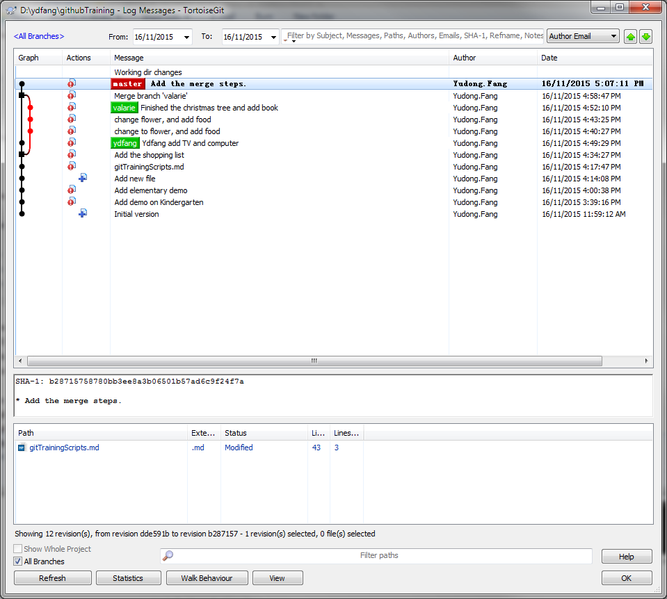
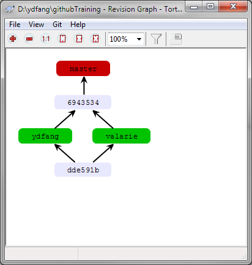
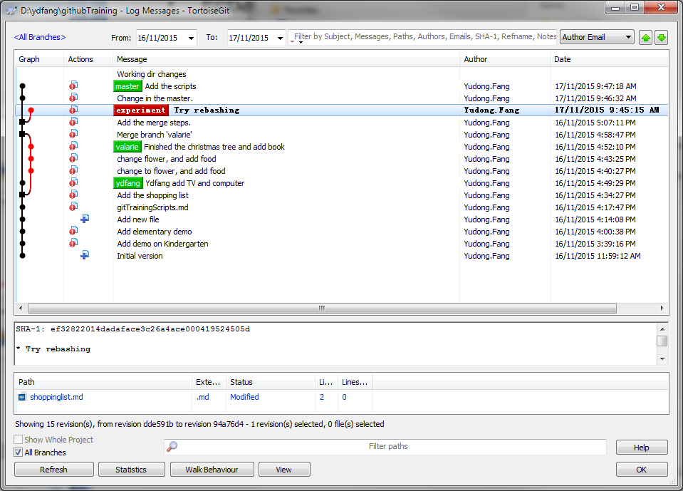
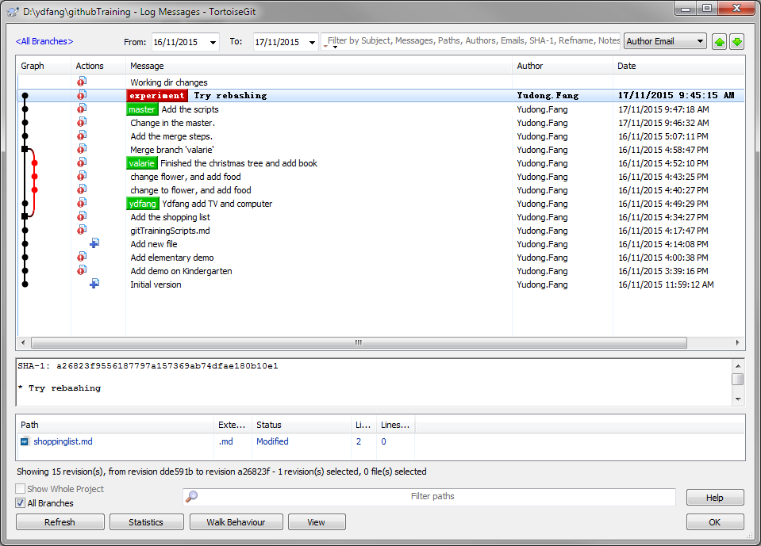

# git demo : set up

## Set up user information

```
git config --global user.name "Yudong.Fang"
git config --global user.email ydfang@hotmail.com
```

## Set up basic tools

```
git config --global core.editor '"C:\Program Files\Sublime Text 3\sublime_text.exe" -w'
git config --global merge.tool kdiff3
git config --global mergetool.kdiff3.cmd '"C:\\Program Files\\KDiff3\\kdiff3" $BASE $LOCAL $REMOTE -o $MERGED'
git config --global diff.tool kdiff3
git config --global difftool.kdiff3.cmd '"C:\\Program Files\\KDiff3\\kdiff3" $BASE $LOCAL'
```
- *Note*: Using '-w' option, so that after you write comments, you don't need to close sublime, jsut close the tab.
- Kdiff3 is a good tools for 3-way merge. ANother good tools: meld, opendiff, emerge.

## check setting
```shell
git help config
git config --list
```

# git demo : kindergarten
## Git Repository
```
git init
```

## Now add file to the folder, change that file using any code editor (such as sublime)
- Add file in OS (gitTriningScripts.md)
- Chang files OS

## add to the stage
- Add to stage
```
git add gitTriningScripts.md
```

- Commit
```
git commit –m “version 1”
```

- check status
```
git status
```

# git demo : Elementary
## Diff
1. generate a html file which not in the vesion control managemed. (ex, click right button and chose export html)
2. run command `git status` and check the status
    - The new create html is showing not in the control
    - The original showing eighter changed or commit
3 run copmmand `git status --staged` to check again
4. run command `git diff HEAD gitTriningScripts.md`
5. Set gui for git difftool
    - double check the git difftool has been set
    - run command 'git difftool gitTriningScripts.md -y'
    - `-y` will save your time

## demo undo
- Demo unmodify file
    + modify the gitTriningScripts.md (ex, These line will be undo)
    + run command `git checkout -- gitTriningScripts.md`
    + Check the file again

## Demo merge by using branch
- prepare: add another file in the repository 
```
touch shoppinglist.md
git commit -a shoppinglist.md
```
+ *Note*: If the gitTriningScripts,md also changed, and didn't add to the commit. This commit only sumbit the new file. This demo the three stages.

- Working branch Valarie
```
git branch valarie
git check valarie
```
- Demo delete branch Yudong
Open another git bash
```
git checkout -b ydfang
git branch

git branch -d ydfang
```


## Demo merge by using branch
- change fiel in ydfang
```
git checkout ydfang
```

cheange file, commit
change file again, commit

- change fiel in valarie
```
git checkout valarie
```

change file, commit;
change file again, commit;
change file again 3, commit;

- switch to master, merge valarie
```
git checkout master
git merge valarie
```
This merge hould be finished

- switch to master, merge ydfang
```
git checkout master
git merge ydfang
```

- Now it said, there is conflict
> Automatic merge failed;...

- solve the conflict
```
git mergetool
```
It will bring the kdiff3

Use this tool to merge the confloct part. Then save and exit.

- git commit
It will merge two branchs.

- results





## Demo on regbasing
``` 
git checkout -b experiment
```
- change the shoppinglist.md

- run commands
```
git add shoppinglist.md

git commit
git checkout master
```
- change shoping list and scripts files.
```
git commit -am "Change in the master"
git checkout experiment
git rebase master
```

The output is
>$ git rebase master <br/>
>First, rewinding head to replay your work on top of it... <br/>
>Applying: Try rebashing




# Github
## SSH keys generate
### generate in Git Bash
```
ssh-keygen -t rsa -C "me@hotmail.com"
```

### Generate in TortoiseGit

## Add to sshd
BY default, it save in the ~/.ssh folder.

## Add public key to GitHub
GitHub support multi public keys so that you can login in multi computers.
- click the icon on the right toppest, then chose Your profile
- Click Edit profile in the right top, 
- Change SSH key in the left side bar, chose Add SSH key
- Input title, and the putlic keys generated.

For the purpose, add the Tortoise Git generated keys also.


# Demo tools setting
## git
- install git and git gutter

*Note*: After install git gutter, yo can find int his file, it has plus or other sign inthe most left area.


## Markdown tools setting
- Install OmniMarkupPreviewer
